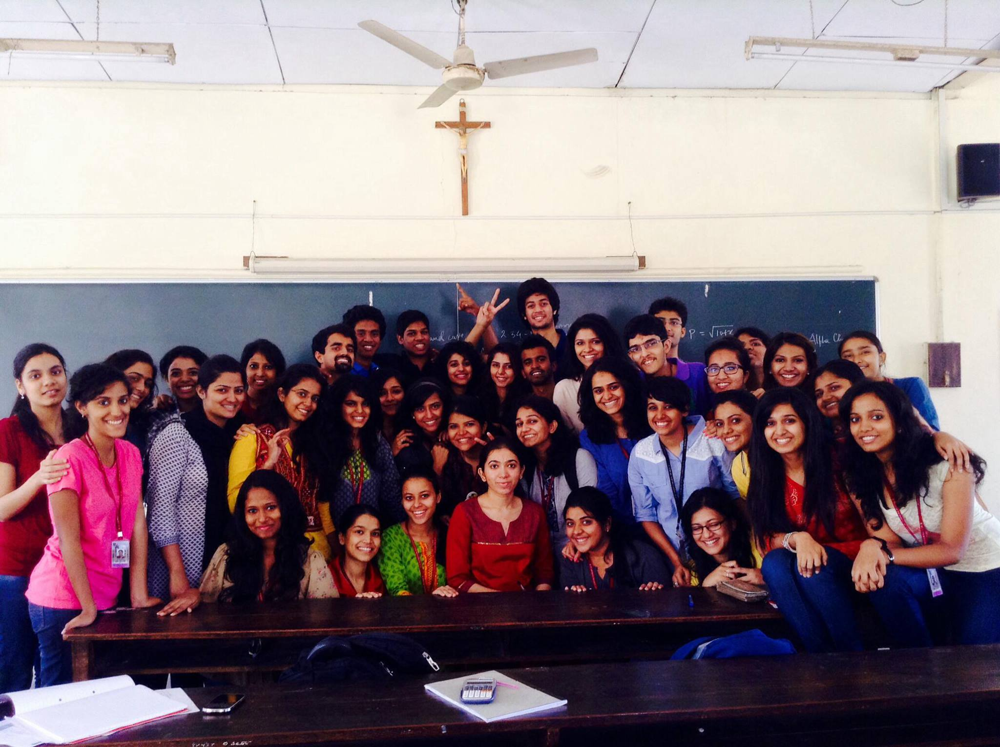
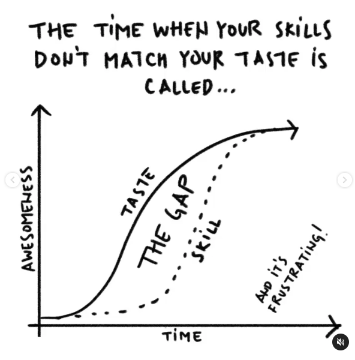
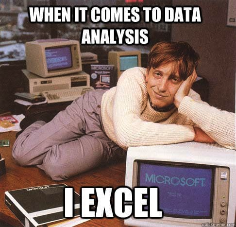
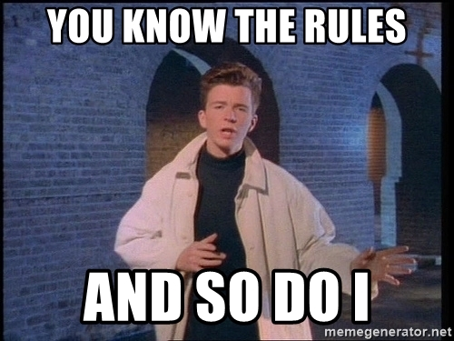

```{css, echo=FALSE}
# CSS for including pauses in printed PDF output (see bottom of lecture)
@media print {
  .has-continuation {
    display: block !important;
  }
}
```

```{r setup, include=FALSE}
xaringanExtra::use_scribble() ## Draw on slides. Requires dev version of xaringanExtra.

options(htmltools.dir.version = FALSE)
library(knitr)
opts_chunk$set(
  fig.align="center",  
  fig.height=4, #fig.width=6,
  # out.width="748px", #out.length="520.75px",
  dpi=300, #fig.path='Figs/',
  cache=T#, echo=F, warning=F, message=F
  )
library(tidyverse)
library(hrbrthemes)
library(fontawesome)
```


# Introductions

### Workshop

`r fa('globe')` https://github.com/shambhavipriyam/writing_econ_intro

All the handouts, notes, and presentations are there.

--

### Me

`r fa('address-book')` Shambhavi Priyam

`r fa('envelope')` [priyam@coll.mpg.de](mailto:priyam@coll.mpg.de)

`r fa('graduation-cap')` PhD Research Fellow; St. Xavier's College alumna 

---

# Economics Department 2014

<div align="center">

</div>

---

# Why this workshop?

- Writing is the trade of students of economics. You cannot get away from it.
  - Policy reports, strategy plans, columns...
  - Journal articles, grant proposals, letters, lesson plans...
  
- Non-economists find it difficult to understand us.

--
> *"That's not writing: that's typing."* ~E. Hemingway


--
- You will be expected to write term papers and reports but will not be taught writing as part of your curriculum. 

- Writing is as important as statistics and maths. 

---

# What are we doing today? 

1. Gyan 

2. Practical stuff 

3. Exercise!

4. Now what?


---

class: inverse, center, middle

# Gyan

<html><div style='float:left'></div><hr color='#EB811B' size=1px width=796px></html>

---

# Gyan No. 1: Be clear

##**Attention is a scarce resource**

- If the reader thinks what you write is unclear, then it is, by definition.

- Readers should not stop and solve a puzzle in every sentence. If you ask a reader to stop, it is hard for them to start again. 

_Would you doomscroll as much if it was harder to do?_

--

- Read what you write after a week and you will be able to pinpoint where things are hard to follow.

---
# Gyan No. 2: Be true 

Choose a subject that meets the needs and also makes your _tummy tingle!_

--
### Economic Poetry

Rhetoric: the art of discovering warrantable beliefs and improving those beliefs in shared discourses (Booth 1974)

  - Invention: framing of arguments worth listening to  
  - Arrangement: putting down on paper what you want to say
  - Style: how you actually want to say those things 
  
---
# Gyan No. 3: Practice, practice, practice

- The problem with reading great writing -> your standards are too high and you don't meet them yourself. 

- Writing well is not something you are born with, you can work to get better. 

<div align="center">
<figure>

<figcaption><a href="https://www.instagram.com/p/CK_w7wjsqmW/">(Source)</a></figcaption>
<figure>
</div>

---
class: inverse, center, middle
name: started

# Practical Stuff

<html><div style='float:left'></div><hr color='#EB811B' size=1px width=796px></html>

---

# Practical stuff - Tools 

### Reading 
- reference management tools (ex. [Zotero](https://www.zotero.org/), [Mendeley](https://www.mendeley.com/)).

### Writing
- a tiny pocketbook and pen, word processing (ex. Overleaf, Markdown, MS Word, Google Docs).

### Data 
- processing and analysis (ex. R, Stata, Python), version control (Git).

### Publishing
- academic journals, established blogs like Econ Declassified ([see handout](https://shambhavipriyam.github.io/writing_econ_intro/handouts/blogs_handout.html) for list of others), self-publishing (ex. Medium, Wordpress, Github Pages), social media (ex. Twitter, Instagram, YouTube).

---
# Practical stuff contd.

#### Set the stage. It's all a performance! 

Everything you write (which includes how you present your work and how you speak about your work) is a performance. You will have to make presentations in _any_ job you go to.  
--

- Read things out loud 
> "Saying it out loud will help. If people wrote more the way they spoke, their writing would have more vigor (if they spoke more the way they wrote their speaking would have more precision)"

--
- Choose your tone
> "You can't just "be yourself" though you will probably do a more persuasive job if the implied author in your writing is similar to yourself."

<div class="footer" style="margin-top;font-size:80%;"> 
Quotes from <i>Economical Writing</i> by D. McCloskey </div>

---
# Practical stuff contd.

#### Keep it simple, silly (sorry, this is gyan again!)

--
- If there is a simpler way to say it, say it that way 
> "Impenetrable theoretical utterances have prestige in economics. That's sad, because no scientific advance can be expected from such games on a blackboard."

--
- Don't use too many words to say the same thing if fewer words will suffice 
>_"Indifferent harvests of 1815 and calamitous volume deficiencies of 1816"_ 
-- both mean the same thing

--
- When revising, add more (active) verbs and delete more adjectives and adverbs. 
--
The trick is to circle as many "is" as you see, and try to replace them. 
> "There is a data reanalysis need" --> "We must reanalyze our data"
> Gamestop stock prices went up _quickly_ --> Gamestop stock prices _skyrocketed_.

<div class="footer" style="margin-top;font-size:80%;"> 
Quotes from <i>Economical Writing</i> by D. McCloskey </div>

---

# A quick sidenote on data

> _"If you torture the data long enough, it will confess to anything"_ ~ Ronald Coase

Data is like your friend who is always helpful, but gullible and can be misused by anyone.

#### Don't manipulate your friends or your data.

--
- Watch out for [spurious correlations](http://www.tylervigen.com/spurious-correlations) 
- It is easy to [lie with your graphs](https://www.datasciencejunction.com/2019/01/how-to-be-cautious-about-misleading.html)
- Look at [all the numbers](https://venngage.com/blog/misleading-graphs/) 

<div align="center">
<figure>

<figcaption>In the wild you may need more than MS Excel</figcaption>
<figure>
</div>

---

# Back to practical stuff

- Using too many "linking" words will make your writing sound clumsy 

> _Yet_, you will remember that all the English teachers spoke a little like this. _Indeed, at times_ professors feel the need to talk this way, but this an attempt to _not only_ mask that they may not be aware of what they are talking of, _but also_ to confuse you so you don't ask more questions. _Therefore_, try to avoid this trait, if you can. _Keep in mind_, the effort it takes to do this is remarkable. _But on the other hand_, the reader is constantly being pushed around by the author which can get tiring.


--
- Keep sentences short 

--
- _Avoid words that bad writers love_ ([see handout](https://shambhavipriyam.github.io/writing_econ_intro/handouts/ch26_McCloskey_Economical_Writing_handout.pdf))

---
class: inverse, center, middle
name: started

# Exercise!

<html><div style='float:left'></div><hr color='#EB811B' size=1px width=796px></html>

---
The interdependence of nations has vastly increased since the previous century, resulting in a
reachable, diverse yet competitive global market space. Given such an environment, the mitigation or reduction of barriers has become a primary concern for international trade. Trade liberalization promotes the idea of free trade amongst countries. But trade liberalisation can prove to be advantageous or disadvantageous for individual economies, depending on the state of its economic performance.


Handout-[LINK](https://shambhavipriyam.github.io/writing_econ_intro/handouts/economicalwriting_handout.pdf)

---
class: inverse, center, middle
name: started

# Now what?

<html><div style='float:left'></div><hr color='#EB811B' size=1px width=796px></html>

---

# Now what?

There are many outlets for you to write and **read** economics.

Be up to date on what is happening!

--
### Academic writing 
- Economics Journals - [rankings](https://www.scimagojr.com/journalrank.php?category=2002) and why they may be [problematic](https://icelab.se/4754-2/#:~:text=There%20is%20no%20doubt%20that,ranking%20system%20is%20not%20transparent)
- Interdisciplinary science journals 


### Non-academic writing 
- Op-eds
- News 
- [Blogs](https://shambhavipriyam.github.io/writing_econ_intro/handouts/blogs_handout.html)
- Twitter - [summary of research](https://twitter.com/LukasKiessling/status/1272876844849782784), [academic chatter](https://twitter.com/search?q=%23EconTwitter&src=typeahead_click), and [random fun things](https://twitter.com/doggonomics)
- YouTube content - [learn by creating](https://www.youtube.com/channel/UCV7OupzIpYe9oIn_QSlyfJw), how I passed my [Economic History](https://www.youtube.com/watch?v=d0nERTFo-Sk&t=380s) class
- Other creative ways - podcasts, on [post-it](https://twitter.com/1969ajo/status/1272566169954893824), [memes](https://www.instagram.com/p/CJqZ4b-j9TS/)


---

# Final thoughts 

<div align="center">
<figure>

<figcaption><a href="https://shambhavipriyam.github.io/writing_econ_intro/handouts/guidelines_handout.html">Are there any rules?</a></figcaption>
<figure>
</div>

